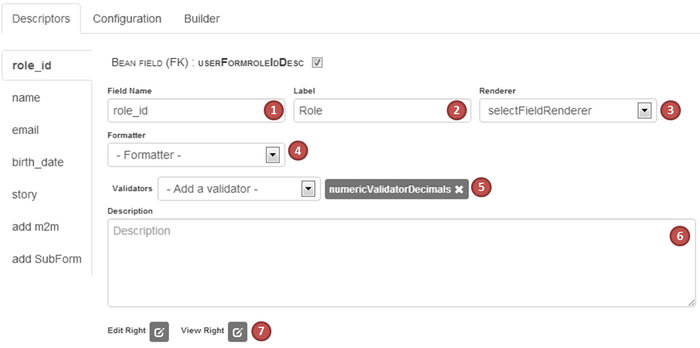
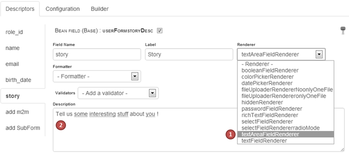
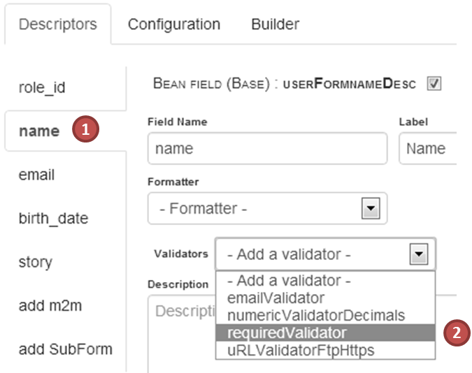
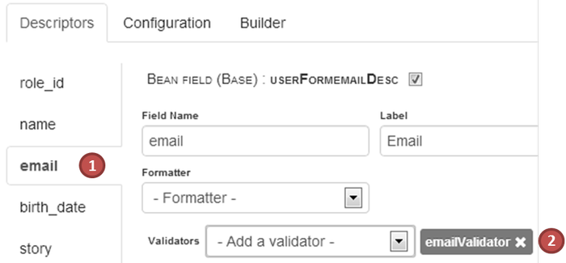
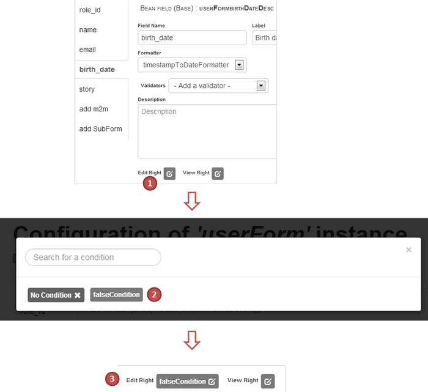
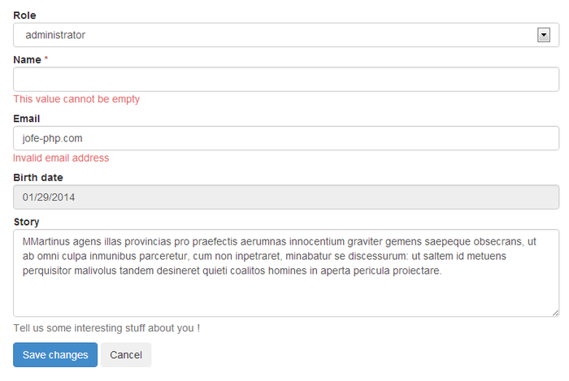

Configuring BCE forms
==

As you saw in the [quickstart chapter](quickstart.md), BCE default configuration already allows to display basic forms. However, as you see in the basic example, the "story" field is not a textarea. Moreover, you might want to add some validation, or even define if a field should be editable.

##Field Descriptor Overview

The main objects that handles a BCE form is the FieldDescriptor. There is one fieldDescriptor by field in your form, and it defines the rendering (textfield, textarea, selectbox, ...), the validation that should be applied to that field, and the required access rights to edit the field.
Moreover, the fieldDescriptor carries the information on how to retrieve an set the data that are displayed in the form.

Here is an example of a foreingKeyFieldDescriptor (used for one to many relationships) that handles user's role :

 

1. **field name** is a unique identifier of the field.
2. **label** is, as it says the text of the field's label
3. **renderer** will handle the display of the field (selectbox, datepicker, etc.)
4. **formatter** will format (before display) and unformat (before persistance) the field's value
5. **validators** will define client-side (JS) and server side validation rules for each field
6. **description** is a simple help text that may be written close to the field
7. **edit & view rights**, if defined will be required to modify or view field's value (si only view right is granted, the field will be readonly)

##Rendering

On thing you should now, is BCE >= 3.1 is using the mouf/html.renderer package for generating the fields' DOM, which means the displayed HTML will depend on the rendering context you set up in your project. By default, the bootstrap rendering is used, if you don't know about the html.renderer package, you should take a look, it's quite powerfull : [mouf/html.renderer documentation](http://mouf-php.com/packages/mouf/html.renderer/README.md).

In order to improve our userForm, we will :

 * change the "story" field's renderer into a textarea renderer
 * add a description in order to tell the users what to enter in this field
 
 

##Validation

As explained in the [quickstart guide](quickstart.md), BCE provides built-in validation on both client AND server side. As for rendering, validation is mainly handled using the mouf/utils.common.validators package (see [documentation here](http://mouf-php.com/packages/mouf/utils.common.validators/)). More than X validators are aleardy implemented (required, numeric, email, url, ...) but you are free to code any other one (simply implement both the ValidatorInterface and the JsValidatorInterface). For the example, we will add a "requiredValidator" to the name field, aswell as an "emailValidator" to the email field : 

| set the name as required | | force email format |
|---|---|---|
|| | |

##Access Rights

Access rights allow you to restrict edition and display of some fields, based on conditions (yet another package of mouf : [mouf/utils.common.conditioninterface](http://mouf-php.com/packages/mouf/utils.common.conditioninterface/README.md)), which might be, for example, rightConditions if you are using mouf's rightsService. For the example, we will use a dummy "falseCondition" that always returns false, and apply it to birth_date field edition :

##Result

Pretty nice isn't it ? :)

> Next: Learn how to handle data that are not directly stored in the `user` table : read [advanced fields](advanced-fields.md).